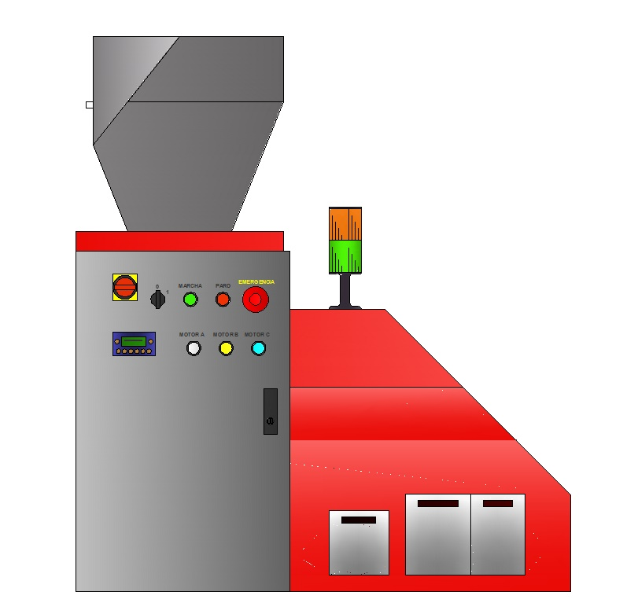
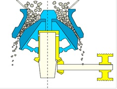
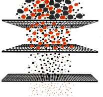
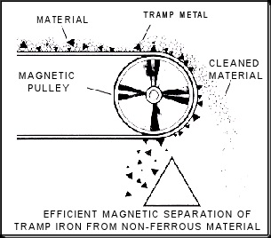

# Electronic-Board-recycler
Final project os master mechatronics 2009

## Description ##

A few years ago, in 2009, i dis a Master o Mechatronics at the foundation CIM UPC in Barcelona. The final project i presented was how to recycle our electronic waste. I believe that both the future of the industry and that of society will be linked to the treatment we make of our waste.

## Key concepts covered ##
- Apply the knowledge developed during the master.
- Design mechanisms and machinery.
- Make an economic assessment of the project.
- Develop the control panel.
- Program the cycles and functions.
- Break a coffee grinder during testing.

## Inspiration ##

The concept is based on two existing models.

- The first is in the mining industry how different minerals are separated by grinding and sieving.

  

- And the second is the use of eddy currents, to separate containers in recycling plants.

## Concept ##

The idea was to crush the electronic circuits and extract the materials by means of eddy currents. Other types of treatments are also proposed to be able to recover the rest of the materials, but it was not the main part of the project.

